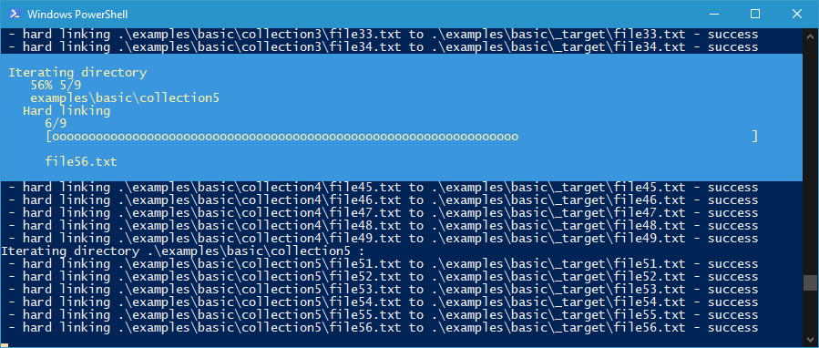

# **Link Nto1** [](https://github.com/VaSe7u/link_Nto1/releases/latest) [](https://opensource.org/licenses/mit-license.php)

Creates hard or symbolic links inside the destination directory to every file
from the source directories.

> *This can be useful when you want to specify multiple folders to be consumed by
a program, but the program only allows selecting a single folder and it doesn't
iterate through its sub-directories (e.g. "Windows 10 Desktop Slideshow"). This
way you are able to quickly reconfigure the set of folders that will be
consumed.*

![screenshot][ss]

<!-- <p align="center">
  
</p> -->

---

## **How to use it**
```powershell
link_Nto1.ps1 [-dst] <String> [-srcs] <String[]> [[-ItemType] <String>]
```

### **Basic example**
Create hard links in `dst_dir` to every file from `src_dir1` and `src_dir2`:
```
  working_dir/
  ├─ link_Nto1.ps1
  │
  ├─ src_dir1/
  │  ├─ file11.ext
  │  └─ file12.ext
  │
  ├─ src_dir2/
  │  ├─ file21.ext
  │  └─ file22.ext
  │
  └─ dst_dir/
```
```powershell
PS> ./link_Nto1.ps1 dst_dir src_dir1,src_dir2
```

```diff
  working_dir/
  │ ...
  │
  └─ dst_dir/
+   ├─ file11.ext (hard link)
+   ├─ file12.ext (hard link)
+   ├─ file21.ext (hard link)
+   └─ file22.ext (hard link)
```

### **Select link type example**
> Available options: `HardLink` and `SymbolicLink`

Create symbolic links inside `dst_dir` to every file from `src_dir`:
```
  working_dir/
  ├─ link_Nto1.ps1
  │
  ├─ src_dir/
  │  ├─ file1.ext
  │  └─ file2.ext
  │
  └─ dst_dir/
```
```powershell
PS> ./link_Nto1.ps1 -dst dst_dir -srcs src_dir -ItemType SymbolicLink
```

```diff
  working_dir/
  │ ...
  │
  └─ dst_dir/
+   ├─ file1.ext (sym link to ../src_dir/file1.ext)
+   └─ file2.ext (sym link to ../src_dir/file2.ext)
```

<details><summary><strong>Windows 10 Desktop Slideshow example</strong></summary>

```
  slideshow/
  ├─ link_Nto1.ps1
  │
  ├─ beach/
  │  ├─ beach.jpg
  │  └─ water.jpg
  │
  ├─ electronics/
  │  ├─ ic.jpg
  │  ├─ rpi4b.png
  │  └─ sd card.jpg
  │
  ├─ nature/
  │  ├─ clouds.jpg
  │  └─ mountain.jpg
  │
  └─ _target/
```

Create hard links in folder `_target` to the files in folders `beach` and `nature`:
```powershell
PS> ./link_Nto1.ps1 -dst _target -srcs beach,nature
```

```diff
  slideshow/
  | ...
  │
  └─ _target/
+   ├─ beach.jpg
+   ├─ water.jpg
+   ├─ clouds.jpg
+   └─ mountain.jpg
```

Change the hard links to the files from folders `beach` and `electronics`:
```powershell
PS> ./link_Nto1.ps1 -dst _target -srcs beach,electronics
```

```diff
  slideshow/
  | ...
  │
  └─ _target/
    ├─ beach.jpg
    ├─ water.jpg
-   ├─ clouds.jpg
-   ├─ mountain.jpg
+   ├─ ic.jpg
+   ├─ rpi4b.png
+   └─ sd card.jpg
```
</details>

<details><summary><strong>How to create a parameterized, runnable shortcut?</strong></summary>

- create the shortcut
- in `Properties`:
  * in field `Target`:
    + prepend "powershell" before "\path\link_Nto1.ps1"
    + append the desired arguments after "\path\link_Nto1.ps1"
 - set field `Start in` according to the location of the specified folders

</details>


[ss]: ./img/screenshot.png
